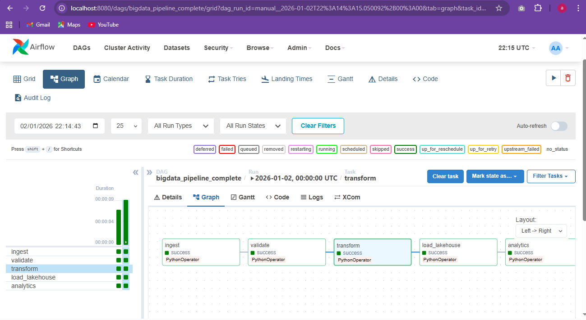
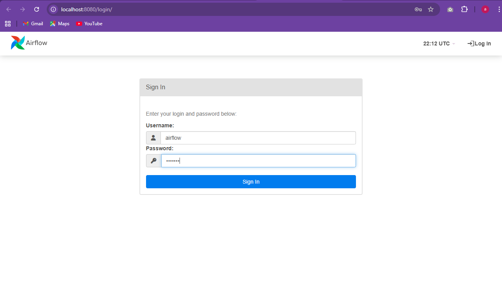
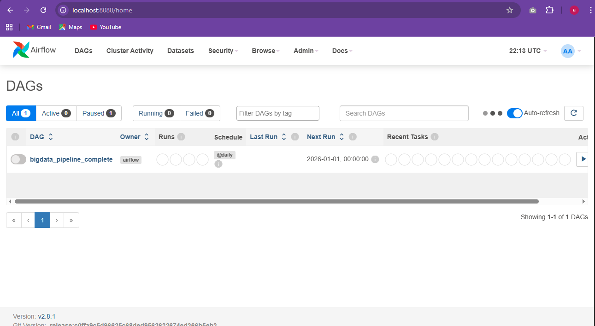
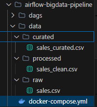

# Atelier Pratique : Orchestration d'un Pipeline Big Data avec Apache Airflow

## Table des matières
- [Introduction](#introduction)
- [Objectifs de l'atelier](#objectifs-de-latelier)
- [Architecture du Pipeline](#architecture-du-pipeline)
- [Technologies Utilisées](#technologies-utilisées)
- [Structure du Projet](#structure-du-projet)
- [Installation et Configuration](#installation-et-configuration)
- [Le DAG Big Data Pipeline](#le-dag-big-data-pipeline)
- [Exécution et Résultats](#exécution-et-résultats)
- [Conclusion](#conclusion)

---

## Introduction

Dans le cadre de cet atelier, j'ai mis en place un pipeline Big Data complet orchestré avec Apache Airflow. L'idée était de simuler un flux de données réaliste qui passe par différentes zones de traitement, depuis l'ingestion des données brutes jusqu'à leur exploitation pour l'analyse.

Apache Airflow est une plateforme open-source qui permet de créer, planifier et surveiller des workflows de données. Ce qui est intéressant avec Airflow, c'est qu'il utilise des DAGs (Directed Acyclic Graphs) pour définir les dépendances entre les tâches, ce qui rend le tout très visuel et facile à suivre.

---

## Objectifs de l'atelier

À travers cet atelier, j'ai pu :

- Déployer Apache Airflow avec Docker
- Comprendre le fonctionnement d'un pipeline Big Data (de la zone Data Lake jusqu'au Data Lakehouse)
- Créer un DAG Airflow qui représente un pipeline complet de traitement
- Orchestrer les différentes étapes du traitement des données
- Surveiller l'exécution des tâches via l'interface graphique d'Airflow

---

## Architecture du Pipeline

Le pipeline que j'ai implémenté suit une architecture moderne de traitement Big Data. Voici le flux de données :

```
INGESTION ──> VALIDATION ──> TRANSFORMATION ──> LAKEHOUSE ──> ANALYTICS
(Data Lake)                    (Big Data)       (Curated)      (BI/ML)
    │                              │                │
    ▼                              ▼                ▼
 data/raw/                   data/processed/   data/curated/
```

Pour mieux comprendre, voici ce que représente chaque zone :

| Zone | Description | Fichiers générés |
|------|-------------|------------------|
| **RAW (Data Lake)** | C'est là où j'ingère les données brutes, sans aucune transformation | `sales.csv` |
| **PROCESSED** | Les données sont nettoyées et structurées ici | `sales_clean.csv` |
| **CURATED (Lakehouse)** | Les données finales, prêtes pour l'analyse business | `sales_curated.csv` |

---

## Technologies Utilisées

Pour réaliser cet atelier, j'ai utilisé les technologies suivantes :

| Technologie | Version | Rôle |
|-------------|---------|------|
| Apache Airflow | 2.8.1 | Orchestration des workflows |
| PostgreSQL | 13 | Stockage des métadonnées Airflow |
| Docker | Latest | Conteneurisation des services |
| Docker Compose | Latest | Orchestration des conteneurs |
| Python | 3.x | Écriture des tâches du DAG |

---

## Structure du Projet

Voici comment j'ai organisé le projet :

```
airflow-bigdata-pipeline/
├── docker-compose.yml          # Configuration Docker
├── README.md                   # Ce fichier de documentation
├── dags/
│   └── bigdata_pipeline.py     # Définition du DAG
├── data/
│   ├── raw/                    # Zone Data Lake
│   │   └── sales.csv
│   ├── processed/              # Zone intermédiaire
│   │   └── sales_clean.csv
│   └── curated/                # Zone Data Lakehouse
│       └── sales_curated.csv
└── screenshots/                # Captures d'écran de l'atelier
```

---

## Installation et Configuration

### Prérequis

Avant de commencer, il faut avoir Docker Desktop installé et en cours d'exécution sur la machine.

### Étape 1 : Cloner le repository

```bash
git clone https://github.com/AkramBENHAMMOU-e/TP6-Big-Data-pipline-orechestration-with-Apache-Airflow.git
cd airflow-bigdata-pipeline
```

### Étape 2 : Initialiser la base de données Airflow

Cette commande permet d'initialiser les métadonnées nécessaires au fonctionnement d'Airflow. C'est une étape à faire une seule fois.

```bash
docker-compose run airflow-webserver airflow db init
```

Voici ce que j'ai obtenu lors de l'exécution :


### Étape 3 : Créer l'utilisateur administrateur

J'ai ensuite créé un compte admin pour accéder à l'interface web d'Airflow :

```bash
docker-compose run airflow-webserver airflow users create \
  --username airflow \
  --password airflow \
  --firstname Airflow \
  --lastname Admin \
  --role Admin \
  --email admin@airflow.local
```


### Étape 4 : Démarrer les services

Une fois la configuration terminée, j'ai lancé tous les services avec la commande suivante :

```bash
docker-compose up -d
```


### Étape 5 : Accéder à l'interface Airflow

L'interface est accessible à l'adresse suivante :
- URL : http://localhost:8080
- Utilisateur : `airflow`
- Mot de passe : `airflow`

---

## Le DAG Big Data Pipeline

### Vue d'ensemble

Le DAG que j'ai créé s'appelle `bigdata_pipeline_complete`. Il contient 5 tâches qui s'exécutent de manière séquentielle :



### Détail des tâches

#### Tâche 1 : Ingestion des données (ingest)

Cette tâche simule l'ingestion de données brutes dans le Data Lake :

```python
def ingest_data():
    os.makedirs(RAW, exist_ok=True)
    with open(f"{RAW}/sales.csv", "w") as f:
        f.write("client,amount\nA,100\nB,200\nA,150\nC,300")
```

Les données sont stockées telles quelles dans le dossier `data/raw/`, sans aucune transformation.

#### Tâche 2 : Validation des données (validate)

Avant de continuer, je vérifie que les données existent bien :

```python
def validate_data():
    if not os.path.exists(f"{RAW}/sales.csv"):
        raise ValueError("Données manquantes")
```

Si le fichier n'existe pas, le pipeline s'arrête avec une erreur. C'est important pour garantir la fiabilité du traitement.

#### Tâche 3 : Transformation Big Data (transform)

Cette étape représente le traitement Big Data. Dans un cas réel, on utiliserait Spark ou du SQL, mais ici je simule le processus :

```python
def transform_data():
    os.makedirs(PROCESSED, exist_ok=True)
    with open(f"{RAW}/sales.csv") as fin, \
         open(f"{PROCESSED}/sales_clean.csv", "w") as fout:
        fout.write(fin.read())
```

Les données nettoyées sont stockées dans `data/processed/`.

#### Tâche 4 : Chargement dans le Lakehouse (load_lakehouse)

Les données sont ensuite chargées dans la zone curated, prêtes pour l'analyse :

```python
def load_lakehouse():
    os.makedirs(CURATED, exist_ok=True)
    with open(f"{PROCESSED}/sales_clean.csv") as fin, \
         open(f"{CURATED}/sales_curated.csv", "w") as fout:
        fout.write(fin.read())
```

#### Tâche 5 : Analytics

La dernière étape marque la fin du pipeline. Les données sont maintenant exploitables pour la BI ou le Machine Learning :

```python
def analytics():
    print("Données prêtes pour BI / Machine Learning")
```

### Configuration du DAG

Voici comment j'ai configuré le DAG avec ses paramètres :

```python
with DAG(
    dag_id="bigdata_pipeline_complete",
    start_date=datetime(2024, 1, 1),
    schedule_interval="@daily",
    catchup=False,
    description="Pipeline Big Data complet orchestré avec Airflow"
) as dag:
    t1 >> t2 >> t3 >> t4 >> t5
```

L'opérateur `>>` définit l'ordre d'exécution : chaque tâche attend que la précédente soit terminée avant de démarrer.

---

## Exécution et Résultats

### Interface Airflow

Une fois connecté, voici l'interface avec la liste des DAGs disponibles :



Après avoir activé le DAG et déclenché une exécution manuelle :



### Fichiers générés

Le pipeline a bien créé les fichiers dans les différentes zones :



Voici le contenu des fichiers générés :

**data/raw/sales.csv**
```
client,amount
A,100
B,200
A,150
C,300
```

**data/processed/sales_clean.csv**
```
client,amount
A,100
B,200
A,150
C,300
```

**data/curated/sales_curated.csv**
```
client,amount
A,100
B,200
A,150
C,300
```

---

## Commandes utiles

Voici les commandes que j'utilise pour gérer Airflow :

| Action | Commande |
|--------|----------|
| Démarrer Airflow | `docker-compose up -d` |
| Arrêter Airflow | `docker-compose down` |
| Voir les logs | `docker-compose logs -f` |
| Redémarrer les services | `docker-compose restart` |
| Vérifier l'état des conteneurs | `docker-compose ps` |

---

## Ce que j'ai appris

### Sur Apache Airflow

- Un **DAG** (Directed Acyclic Graph) est un graphe qui représente le workflow avec ses dépendances
- Une **Task** est une unité de travail dans le DAG
- Un **Operator** définit le type de tâche (PythonOperator pour du code Python, BashOperator pour des commandes shell, etc.)
- Le **Scheduler** est le composant qui orchestre l'exécution des tâches
- Le **Webserver** fournit l'interface graphique pour surveiller les pipelines

### Sur l'architecture Big Data

- Le **Data Lake** sert à stocker les données brutes sans transformation
- Le **Data Lakehouse** combine les avantages du Data Lake et du Data Warehouse
- Le processus **ETL** (Extract, Transform, Load) permet de traiter les données étape par étape

---

## Conclusion

Cet atelier m'a permis de mettre en pratique l'orchestration d'un pipeline Big Data avec Apache Airflow. J'ai pu :

1. Déployer Airflow avec Docker, avec PostgreSQL pour les métadonnées et les composants Webserver et Scheduler
2. Créer un DAG complet avec 5 tâches représentant un flux de traitement réaliste
3. Simuler le passage des données à travers les zones : Ingestion vers Validation vers Transformation vers Lakehouse vers Analytics
4. Surveiller l'exécution des tâches via l'interface graphique
5. Vérifier que les fichiers de données sont bien créés dans chaque zone

Cette approche est directement applicable en environnement professionnel pour orchestrer des traitements Big Data réels avec des technologies comme Spark, Hadoop, ou des solutions cloud.

